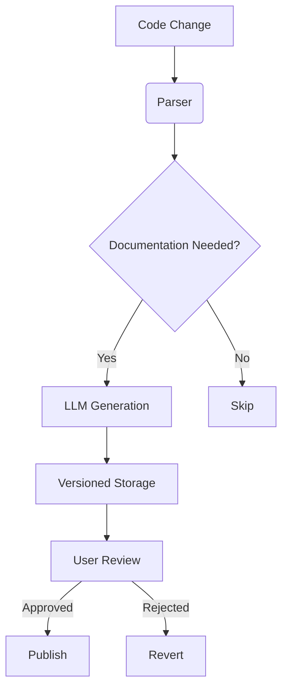
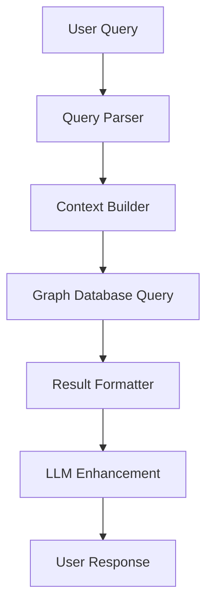

# Code Documentation and Visualization Tool

**Document Version:** 1.0.0

**Last Modified:** 2025-04-18

**Owner:** Product Team

## Table of Contents

1. [Introduction](https://www.notion.so/Product-Requirements-Document-1d90f23c365680d29dc8c62bc3b61de5?pvs=21)
    1. [Purpose](https://www.notion.so/Product-Requirements-Document-1d90f23c365680d29dc8c62bc3b61de5?pvs=21)
    2. [Scope](https://www.notion.so/Product-Requirements-Document-1d90f23c365680d29dc8c62bc3b61de5?pvs=21)
    3. [Definitions and Acronyms](https://www.notion.so/Product-Requirements-Document-1d90f23c365680d29dc8c62bc3b61de5?pvs=21)
    4. [References](https://www.notion.so/Product-Requirements-Document-1d90f23c365680d29dc8c62bc3b61de5?pvs=21)
    5. [Overview](https://www.notion.so/Product-Requirements-Document-1d90f23c365680d29dc8c62bc3b61de5?pvs=21)
2. [Overall Description](https://www.notion.so/Product-Requirements-Document-1d90f23c365680d29dc8c62bc3b61de5?pvs=21)
    1. [Product Perspective](https://www.notion.so/Product-Requirements-Document-1d90f23c365680d29dc8c62bc3b61de5?pvs=21)
    2. [Product Functions](https://www.notion.so/Product-Requirements-Document-1d90f23c365680d29dc8c62bc3b61de5?pvs=21)
    3. [User Characteristics](https://www.notion.so/Product-Requirements-Document-1d90f23c365680d29dc8c62bc3b61de5?pvs=21)
    4. [Constraints](https://www.notion.so/Product-Requirements-Document-1d90f23c365680d29dc8c62bc3b61de5?pvs=21)
    5. [Assumptions and Dependencies](https://www.notion.so/Product-Requirements-Document-1d90f23c365680d29dc8c62bc3b61de5?pvs=21)
3. [Specific Requirements](https://www.notion.so/Product-Requirements-Document-1d90f23c365680d29dc8c62bc3b61de5?pvs=21)
    1. [External Interface Requirements](https://www.notion.so/Product-Requirements-Document-1d90f23c365680d29dc8c62bc3b61de5?pvs=21)
    2. [Functional Requirements](https://www.notion.so/Product-Requirements-Document-1d90f23c365680d29dc8c62bc3b61de5?pvs=21)
    3. [Performance Requirements](https://www.notion.so/Product-Requirements-Document-1d90f23c365680d29dc8c62bc3b61de5?pvs=21)
    4. [Design Constraints](https://www.notion.so/Product-Requirements-Document-1d90f23c365680d29dc8c62bc3b61de5?pvs=21)
    5. [System Attributes](https://www.notion.so/Product-Requirements-Document-1d90f23c365680d29dc8c62bc3b61de5?pvs=21)
    6. [Other Requirements](https://www.notion.so/Product-Requirements-Document-1d90f23c365680d29dc8c62bc3b61de5?pvs=21)
4. [Technical Specifications](https://www.notion.so/Product-Requirements-Document-1d90f23c365680d29dc8c62bc3b61de5?pvs=21)
    1. [Code Parsing](https://www.notion.so/Product-Requirements-Document-1d90f23c365680d29dc8c62bc3b61de5?pvs=21)
    2. [Graph Database](https://www.notion.so/Product-Requirements-Document-1d90f23c365680d29dc8c62bc3b61de5?pvs=21)
    3. [LLM Integration](https://www.notion.so/Product-Requirements-Document-1d90f23c365680d29dc8c62bc3b61de5?pvs=21)
    4. [Visualization](https://www.notion.so/Product-Requirements-Document-1d90f23c365680d29dc8c62bc3b61de5?pvs=21)
5. [Development Roadmap](https://www.notion.so/Product-Requirements-Document-1d90f23c365680d29dc8c62bc3b61de5?pvs=21)
    1. [MVP Phase](https://www.notion.so/Product-Requirements-Document-1d90f23c365680d29dc8c62bc3b61de5?pvs=21)
    2. [Version 1.0](https://www.notion.so/Product-Requirements-Document-1d90f23c365680d29dc8c62bc3b61de5?pvs=21)
    3. [Version 2.0](https://www.notion.so/Product-Requirements-Document-1d90f23c365680d29dc8c62bc3b61de5?pvs=21)
6. [Validation Framework](https://www.notion.so/Product-Requirements-Document-1d90f23c365680d29dc8c62bc3b61de5?pvs=21)
    1. [Testing Methodologies](https://www.notion.so/Product-Requirements-Document-1d90f23c365680d29dc8c62bc3b61de5?pvs=21)
    2. [Accuracy Test Matrix](https://www.notion.so/Product-Requirements-Document-1d90f23c365680d29dc8c62bc3b61de5?pvs=21)
    3. [Performance Benchmarks](https://www.notion.so/Product-Requirements-Document-1d90f23c365680d29dc8c62bc3b61de5?pvs=21)
7. [Requirement Traceability Matrix](https://www.notion.so/Product-Requirements-Document-1d90f23c365680d29dc8c62bc3b61de5?pvs=21)
8. [Appendices](https://www.notion.so/Product-Requirements-Document-1d90f23c365680d29dc8c62bc3b61de5?pvs=21)
    1. [System Workflows](https://www.notion.so/Product-Requirements-Document-1d90f23c365680d29dc8c62bc3b61de5?pvs=21)
    2. [Market Analysis](https://www.notion.so/Product-Requirements-Document-1d90f23c365680d29dc8c62bc3b61de5?pvs=21)

## 1. Introduction

### 1.1 Purpose

This document specifies the requirements for a code documentation and visualization tool designed to assist software developers in onboarding to new projects and automating documentation processes using large language models (LLMs) and codebase visualization tools.

### 1.2 Scope

The system will parse codebases, create visual representations of code dependencies, enable LLM-powered querying of codebases, and automate documentation generation and updates. The initial focus will be on Golang support, with plans to extend to Python, JavaScript, TypeScript, and Java.

### 1.3 Definitions and Acronyms

- **LLM**: Large Language Model
- **LOC**: Lines of Code
- **AST**: Abstract Syntax Tree
- **CI/CD**: Continuous Integration/Continuous Deployment
- **PR**: Pull Request

### 1.4 References

- IEEE STD 830-1998 Software Requirements Specification
- Git Documentation
- Neo4J Documentation
- Tree-sitter Documentation

### 1.5 Overview

The remainder of this document provides a detailed description of the proposed system, including overall functionality, specific requirements, technical specifications, development roadmap, and validation framework.

## 2. Overall Description

### 2.1 Product Perspective

This product is a standalone tool that integrates with existing version control systems (Git) and CI/CD pipelines (GitHub, GitLab, Jenkins) to provide code visualization and documentation automation. It aims to simplify developer onboarding and reduce documentation overhead.

### 2.2 Product Functions

The primary functions of the system include:

- Parsing codebases to extract structural information
- Building and maintaining a graph database of code dependencies
- Providing visual representations of code structure and relationships
- Enabling LLM-based querying of codebase information
- Automating documentation generation and updates based on code changes

### 2.3 User Characteristics

### 2.3.1 Primary Persona: Software Developers (Onboarding)

- Experience levels ranging from intern to senior
- Need to understand large and/or complex codebases quickly
- May be unfamiliar with the project's structure and dependencies
- Want to start making meaningful contributions promptly

### 2.3.2 Primary Persona: Software Developers (Documentation)

- Experience levels ranging from intern to senior
- Responsible for maintaining accurate documentation
- Face challenges keeping documentation in sync with code changes
- Need to focus on development rather than documentation overhead

### 2.4 Constraints

### 2.4.1 Development Constraints

- One-person project with limited time availability (after work hours)
- No budget allocation
- Three-month timeline for MVP delivery

### 2.4.2 Technical Constraints

- Hosting environments limited to AWS or on-premise
- Need for role-based access controls
- Data privacy requirements for private codebases

### 2.5 Assumptions and Dependencies

- Assumes access to Git repositories
- Depends on stable APIs for LLM services
- Assumes compatible parsing libraries for target programming languages

## 3. Specific Requirements

### 3.1 External Interface Requirements

### 3.1.1 User Interfaces

- Web-based UI for graph visualization
- Chat interface for LLM queries
- Dashboard for project selection and management

### 3.1.2 Software Interfaces

- Git integration for code access and change detection
- CI/CD pipeline integration (GitHub, GitLab, Jenkins)
- LLM API integration (Claude 3.7 Sonnet, Gemini 2.5, GPT)

### 3.1.3 Communication Interfaces

- RESTful API for service communication
- WebSocket for real-time visualization updates
- HTTPS for secure data transmission

### 3.2 Functional Requirements

### 3.2.1 Code Parsing Functionality

- FR-1: The system shall parse Golang source code to extract structural information.
- FR-2: The system shall identify and extract functions, classes, imports, interfaces, structs, constants, and variables.
- FR-3: The system shall determine relationships between code elements (e.g., function calls, interface implementations).
- FR-4: The system shall handle codebases ranging from 10K to 1M+ LOC.

### 3.2.2 Graph Database Functionality

- FR-5: The system shall store parsed code structure in a graph database.
- FR-6: The system shall maintain relationships between code elements.
- FR-7: The system shall update the database when code changes are detected.
- FR-8: The system shall support querying for code relationships.

### 3.2.3 LLM Integration Functionality

- FR-9: The system shall enable natural language queries about code structure.
- FR-10: The system shall answer questions about function calls, interface implementations, and file locations.
- FR-11: The system shall generate documentation based on code analysis.
- FR-12: The system shall update documentation when code changes are detected.

### 3.2.4 Visualization Functionality

- FR-13: The system shall provide a visual representation of code dependencies.
- FR-14: The system shall support filtering and searching within the visualization.
- FR-15: The system shall enable drill-down into specific code elements.
- FR-16: The system shall support exporting visualization data.

### 3.2.5 Integration Functionality

- FR-17: The system shall integrate with Git repositories.
- FR-18: The system shall detect code changes through CI/CD pipelines.
- FR-19: The system shall generate documentation in Markdown format.
- FR-20: The system shall support documentation export to various platforms.

### 3.3 Performance Requirements

- PR-1: The system shall parse 10K LOC within 15 seconds for the MVP.
- PR-2: The system shall parse 1M LOC within 2 minutes for v1.0.
- PR-3: The system shall achieve 90% accuracy in documentation generation.
- PR-4: The system shall provide visualization response times under 3 seconds.
- PR-5: The system shall handle concurrent users without performance degradation.

### 3.4 Design Constraints

- DC-1: The system shall follow a microservices architecture.
- DC-2: The system shall use containerization for deployment.
- DC-3: The system shall implement role-based access control.
- DC-4: The system shall ensure data privacy for private codebases.

### 3.5 System Attributes

### 3.5.1 Reliability

- The system shall maintain accuracy in code parsing and relationship detection.
- The system shall gracefully handle parsing errors.

### 3.5.2 Security

- The system shall implement authentication for user access.
- The system shall ensure confidentiality of private codebases.
- The system shall log access and changes for audit purposes.

### 3.5.3 Maintainability

- The system shall follow a modular design for easy maintenance.
- The system shall include comprehensive test coverage.
- The system shall maintain documentation of its own architecture.

### 3.5.4 Portability

- The system shall deploy to AWS or on-premise environments.
- The system shall use containerization for consistent deployment.

### 3.6 Other Requirements

- The system shall be open source with a clear license.
- The system shall support a subscription model for managed services and support.

## 4. Technical Specifications

### 4.1 Code Parsing

### Table 1: Code Parsing Technical Specifications

| Component | Tech Stack | Version | Rationale |
| --- | --- | --- | --- |
| Go Parser | Tree-sitter | 0.20.8 | AST accuracy and performance |
| Python Parser | Tree-sitter | 0.20.8 | Consistent parsing across languages |
| JavaScript/TypeScript Parser | Tree-sitter | 0.20.8 | Handles complex JS/TS patterns |
| Java Parser | Tree-sitter | 0.20.8 | Robust Java syntax support |
| Relation Analyzer | Custom | 1.0.0 | Extract relationships between parsed elements |

### 4.2 Graph Database

### Table 2: Graph Database Technical Specifications

| Component | Tech Stack | Version | Rationale |
| --- | --- | --- | --- |
| Graph Database | Neo4J | 5.9.0 | Industry-standard graph database with mature query language |
| Database API | GraphQL | 16.6.0 | Flexible querying of graph relationships |
| Caching Layer | Redis | 7.0.5 | Improve query performance for frequent patterns |
| Schema Migration | Custom | 1.0.0 | Handle schema evolution as language support expands |

### 4.3 LLM Integration

### Table 3: LLM Integration Technical Specifications

| Component | Tech Stack | Version | Rationale |
| --- | --- | --- | --- |
| Primary LLM | Claude 3.7 Sonnet | API v1 | Strong code understanding capabilities |
| Alternative LLMs | Gemini 2.5, GPT-4.5 | Latest | Provide options for different needs/preferences |
| Query Handler | Custom | 1.0.0 | Translate natural language to graph queries |
| Documentation Generator | Custom | 1.0.0 | Transform code analysis to structured documentation |
| Context Manager | Custom | 1.0.0 | Maintain context for multi-turn queries |

### 4.4 Visualization

### Table 4: Visualization Technical Specifications

| Component | Tech Stack | Version | Rationale |
| --- | --- | --- | --- |
| Frontend Framework | React | 18.2.0 | Robust UI framework with strong ecosystem |
| Visualization Library | D3.js | 7.8.0 | Powerful graph visualization capabilities |
| UI Components | Material UI | 5.14.0 | Consistent, accessible component library |
| State Management | Redux | 4.2.1 | Maintain complex state across visualization components |
| API Client | Apollo | 3.7.0 | GraphQL client with caching capabilities |

## 5. Development Roadmap

### 5.1 MVP Phase

**Timeline:** 3 months

### 5.1.1 MVP Features

- Golang package imports parsing and relationship detection
- Basic Neo4J database implementation
- Simple graph visualization of import relationships
- Basic LLM integration for import relationship queries

### 5.1.2 MVP Completion Criteria

```
MVP Done When:
- 95% Go import relations parsed correctly
- Basic Neo4J visualization operational
- LLM answers 80% basic queries accurately
- Web UI provides basic visualization and query interface

```

### 5.2 Version 1.0

**Timeline:** 6 months

### 5.2.1 Version 1.0 Features

- Complete Golang parsing (all code relationships)
- Enhanced visualization with filtering and search
- Advanced LLM integration for comprehensive code queries
- Documentation generation based on code changes
- CI/CD integration for automated updates

### 5.2.2 Version 1.0 Completion Criteria

```
Version 1.0 Done When:
- 95% of all Go code relationships parsed correctly
- Advanced visualization features fully operational
- LLM answers 90% of code queries accurately
- Documentation generation achieves 85% accuracy
- CI/CD integration successfully detects and processes code changes

```

### 5.3 Version 2.0

**Timeline:** 1 year

### 5.3.1 Version 2.0 Features

- Support for at least 3 programming languages (Go, Python, JavaScript/TypeScript)
- Cross-language relationship detection
- Enhanced documentation generation with formatting options
- Expanded visualization capabilities
- User management and access controls

### 5.3.2 Version 2.0 Completion Criteria

```
Version 2.0 Done When:
- 90%+ parsing accuracy across all supported languages
- Cross-language relationships detected with 85%+ accuracy
- Documentation generation achieves 90% accuracy
- Visualization handles complex, multi-language projects
- User management system fully operational

```

## 6. Validation Framework

### 6.1 Testing Methodologies

- Unit testing for individual components
- Integration testing for component interactions
- End-to-end testing for complete workflows
- Performance testing for scalability validation
- User acceptance testing for feedback collection

### 6.2 Accuracy Test Matrix

### Table 5: Accuracy Test Matrix

| Query Type | Sample Size | Threshold |
| --- | --- | --- |
| Function Calls | 1000 | 95% |
| Interface Implementations | 500 | 90% |
| Package Imports | 2000 | 98% |
| Variable Usage | 800 | 85% |
| Documentation Updates | 300 | 90% |

### 6.3 Performance Benchmarks

### Table 6: Performance Benchmark Targets

| Metric | MVP Target | v1.0 Target | v2.0 Target |
| --- | --- | --- | --- |
| Go Parsing Speed | 10K LOC/15s | 1M LOC/2m | 1M LOC/1m |
| Python Parsing Speed | N/A | 500K LOC/2m | 1M LOC/1.5m |
| JS/TS Parsing Speed | N/A | 500K LOC/2m | 1M LOC/1.5m |
| Visualization Loading | 5s | 3s | 2s |
| Query Response Time | 5s | 3s | 2s |

## 7. Requirement Traceability Matrix

### Table 7: Requirement Traceability Matrix

| Req ID | Description | Test Case | MVP | v1.0 | v2.0 |
| --- | --- | --- | --- | --- | --- |
| FR-1 | Parse Golang code | TC-001 | ✅ | ✅ | ✅ |
| FR-2 | Extract code elements | TC-002 | ⚠️ | ✅ | ✅ |
| FR-3 | Determine relationships | TC-003 | ⚠️ | ✅ | ✅ |
| FR-4 | Handle large codebases | TC-004 | ⚠️ | ✅ | ✅ |
| FR-5 | Store in graph database | TC-005 | ✅ | ✅ | ✅ |
| FR-6 | Maintain relationships | TC-006 | ✅ | ✅ | ✅ |
| FR-7 | Update on code changes | TC-007 | ❌ | ✅ | ✅ |
| FR-8 | Support relationship queries | TC-008 | ⚠️ | ✅ | ✅ |
| FR-9 | Enable natural language queries | TC-009 | ⚠️ | ✅ | ✅ |
| FR-10 | Answer code questions | TC-010 | ⚠️ | ✅ | ✅ |
| FR-11 | Generate documentation | TC-011 | ❌ | ✅ | ✅ |
| FR-12 | Update documentation | TC-012 | ❌ | ✅ | ✅ |
| FR-13 | Provide visualization | TC-013 | ✅ | ✅ | ✅ |
| FR-14 | Support filtering/searching | TC-014 | ❌ | ✅ | ✅ |
| FR-15 | Enable drill-down | TC-015 | ❌ | ✅ | ✅ |
| FR-16 | Support data export | TC-016 | ❌ | ⚠️ | ✅ |
| FR-17 | Git integration | TC-017 | ✅ | ✅ | ✅ |
| FR-18 | Detect code changes | TC-018 | ❌ | ✅ | ✅ |
| FR-19 | Generate Markdown | TC-019 | ❌ | ✅ | ✅ |
| FR-20 | Support export platforms | TC-020 | ❌ | ⚠️ | ✅ |

Legend:

- ✅: Fully implemented
- ⚠️: Partially implemented
- ❌: Not implemented

## 8. Appendices

### 8.1 System Workflows

### Figure 1: Documentation Update Workflow



### Figure 2: Code Query Workflow



### 8.2 Market Analysis

While a comprehensive market analysis is not within the scope of this PRD, the product will operate in a space that includes code analysis tools, documentation generators, and development productivity tools. The open source with paid support model aims to balance accessibility with sustainability.

The primary differentiator for this product is the integration of code visualization, LLM-powered querying, and automated documentation generation in a single tool, specifically targeting the developer onboarding and documentation maintenance pain points.
